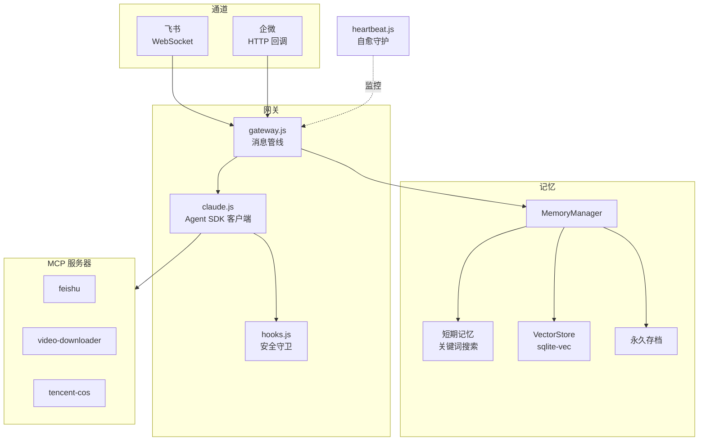

# OpenMist

[](https://github.com/mistprismlabs/open-mist/actions/workflows/ci.yml)
[](LICENSE)


**破雾寻光** — 穿越迷雾，直抵本质。

> 基于 Claude Agent SDK + Claude Code 的企业级智能助手运行时。不重造轮子，直接站在 Claude Code 肩膀上。

[English](README.en.md)

---

## 为什么选 OpenMist

OpenClaw 提供了构建 AI Agent 的框架。OpenMist 选择了不同的路径：不在 Claude 外面再套一层抽象，而是直接用 Claude Code 作为 Agent 运行时，白拿它的工具生态、安全模型和可扩展性。

| 能力 | OpenClaw | OpenMist |
|------|----------|----------|
| **运行时** | 自定义 Agent 循环 | Claude Code（原生 SDK） |
| **安全** | 应用层防护 | SDK Hooks — 运行时层 PreToolUse 拦截，prompt 无法绕过 |
| **Skill 安全** | 无 | 双层保险：提示词引导 + Hooks 硬拦截 + 飞书审批 |
| **记忆** | 无状态 / 自行实现 | 三层混合 + 多租户隔离 + Haiku 智能摘要 |
| **工具生态** | 自定义工具定义 | MCP 协议 — 复用任何 MCP Server，无需适配代码 |
| **自愈** | 手动运维 | AI 驱动的心跳守护：自动修复 cron 失败、磁盘压力、权限漂移 |
| **IM 接入** | 仅 API | 飞书/企微原生适配器，流式卡片、媒体处理、会话管理 |
| **部署** | 容器化 | 单 Node.js 进程 + systemd，自动子域名部署 |

核心洞察：Claude Code 本身就是最强的 Agent 运行时。在它之上构建（而非重建）意味着上游的每一次改进（新工具、更好的规划、更快的执行）都会自动流入。

---

## 核心特性

### SDK 级安全 Hooks

在 Claude Code 运行时层面运作的生产级安全防护。Bash 命令过滤拦截 5 类破坏性操作（不可逆破坏、凭证泄露、环境变量转储、sudo 提权、eval 注入），同时放行所有合法系统操作。Write/Edit 路径白名单阻止未授权文件访问。每次工具调用记录到只追加审计日志。

### Skill Vetter 安全网关 `v1.3`

任何 skill/plugin 安装前的双层安全审查：

- **B 层（提示词）**：系统指令要求 Agent 主动执行 `/skill-vetter` 审查
- **A 层（Hooks）**：硬拦截兜底，拦截 `claude plugin install/update` 和写入 `.claude/skills/` 的所有操作

审查通过 4 步协议（元数据检查、权限分析、内容扫描、仿冒检测），结论通过飞书卡片发送给用户，用户确认后立即安装并自动续接原任务。白名单持久化，已审核的 skill 下次直接放行。

### 三层混合记忆 + 多租户隔离

工作记忆（进程内关键词搜索）用于当前会话上下文。向量检索（DashScope 嵌入 + sqlite-vec）实现跨会话语义召回。永久存档用于对话摘要和长期知识。混合搜索融合 70% 语义相似度 + 30% 关键词匹配，向量层不可用时自动降级为纯关键词。MMR 重排序消除冗余记忆；30 天半衰期的时间衰减确保近期记忆优先，高重要性记忆豁免衰减。**v1.3**: 多租户记忆隔离——userId 全链路传递，不同用户的记忆互不可见。对话结束时 Haiku 自动提取精炼意图和关键决策，提升检索精度。

### 多通道网关 + 用户初始化

统一消息管线将 Claude 交互与平台解耦。内置飞书（WebSocket 长连接）和企微（HTTP 回调 + 企业应用）适配器。新增通道只需实现一个适配器类。会话管理、媒体处理、流式卡片更新、记忆注入在网关层统一处理。首次用户通过初始化卡片设置助手名称、称呼、使用场景和语言，偏好持久化并注入每次对话。

### AI 驱动自愈 + 自动更新

心跳守护进程每 30 分钟执行两阶段检查。第一阶段（原生）：孤儿进程清理、文件权限审计、VectorStore 可写性测试——毫秒级完成。第二阶段（AI）：Claude 分析系统状态，自动修复 cron 失败、磁盘压力或陈旧锁等问题。通知聚合为每日摘要。自动更新机制每天检查 3 个来源（Claude CLI、Agent SDK、仓库），通过飞书卡片通知，用户批准后独立 cron 脚本安全执行。

### MCP 工具服务器

三个内置 MCP 服务器扩展 Claude 能力：

| 服务器 | 说明 |
|--------|------|
| `feishu` | 飞书全套 API：多维表格 CRUD、云文档创建与授权、云空间操作、消息发送 |
| `video-downloader` | 视频下载（YouTube、B站、抖音等） |
| `tencent-cos` | 腾讯云 COS：上传、下载、预签名 URL |

MCP 服务器由 Claude 客户端自动启动，无需额外配置。

---

## 架构



---

## 快速开始

### 前置条件

- Node.js >= 18
- [Claude Code CLI](https://github.com/anthropics/claude-code)（Agent SDK 运行在 Claude Code 之上）
- SQLite3（用于 sqlite-vec 向量存储）
- Anthropic API Key（或兼容端点）
- 飞书应用凭证（App ID + App Secret）

### 安装

```bash
# 1. 安装 Claude Code CLI（必需）
npm install -g @anthropic-ai/claude-code

# 2. 克隆并安装依赖
git clone https://github.com/mistprismlabs/open-mist.git
cd open-mist
npm install
```

### 配置

```bash
cp .env.example .env
```

核心配置项：

| 变量 | 说明 |
|------|------|
| `ANTHROPIC_API_KEY` | Anthropic API 密钥 |
| `ANTHROPIC_BASE_URL` | API 端点（默认 `https://api.anthropic.com`） |
| `CLAUDE_MODEL` | 模型 ID（默认 `claude-opus-4-6`） |
| `FEISHU_APP_ID` | 飞书应用 ID |
| `FEISHU_APP_SECRET` | 飞书应用密钥 |
| `DASHSCOPE_API_KEY` | 阿里云百炼密钥（用于向量嵌入） |
| `ADMIN_USER_ID` | 管理员 open_id（多租户迁移，可选，fallback 到 `FEISHU_OWNER_ID`） |
| `WECOM_CORP_ID` | 企微企业 ID（可选） |
| `COS_SECRET_ID` | 腾讯云 COS Secret ID（可选） |
| `COS_SECRET_KEY` | 腾讯云 COS Secret Key（可选） |

### 运行

```bash
npm start
```

生产部署：

```bash
sudo systemctl enable --now feishu-bot.service
```

---

## 项目结构

```
src/
  index.js              # 入口
  gateway.js            # 消息管线（记忆 → Claude → 追踪）
  claude.js             # Claude Agent SDK 封装 + MCP 配置
  hooks.js              # PreToolUse 安全守卫 + PostToolUse 审计 + Skill 白名单
  session.js            # 会话存储（过期与轮转）
  user-profile.js       # 用户偏好（初始化 + 个性化）
  channels/
    base.js             # 通道适配器接口
    feishu.js           # 飞书适配器（WebSocket）
    wecom.js            # 企微适配器
  memory/
    memory-manager.js   # 三层记忆编排器
    short-term.js       # 工作记忆（关键词搜索）
    vector-store.js     # 语义搜索（DashScope + sqlite-vec）
    metrics.js          # 记忆管线指标
  heartbeat.js          # 自愈守护进程
  deployer.js           # 自动子域名部署（nginx）
  mcp-feishu.mjs        # MCP: 飞书 API
  mcp-video.mjs         # MCP: 视频下载
  mcp-cos.mjs           # MCP: 腾讯云 COS
scripts/                # 运维自动化（cron 任务、清理、报告）
.claude/skills/         # 开发工作流 Skills + Skill Vetter 安全审查
```

---

## 参与贡献

欢迎贡献：

1. Fork 并创建特性分支
2. 每个 PR 只做一件事
3. 提交前测试
4. 写清楚 commit message

---

## 许可证

[MIT](LICENSE)
