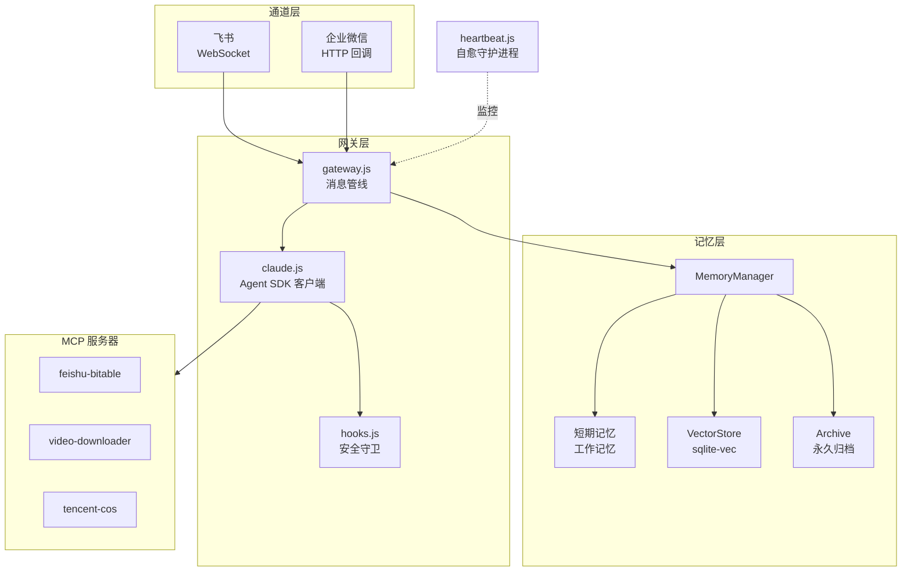

# OpenMist

[](LICENSE)

[English](README.en.md) | 中文

**拨开迷雾，找到光。**

OpenMist 是一个基于 Claude Agent SDK 构建的生产级智能助手网关。它将 Claude 连接到 IM 平台（飞书、企业微信），并提供企业级功能：多层记忆系统、SDK 安全守卫和 AI 驱动的自愈能力。

---

## 核心特性

### 生产级 Claude Agent SDK 安全守卫

首个开源的 SDK 安全 Hooks 参考实现。Bash 命令过滤可拦截破坏性操作、凭证泄露和权限提升。Write/Edit 路径白名单防止未授权的文件访问。每次工具调用都记录到只追加的审计日志中。

### 混合记忆系统

三层记忆架构——工作记忆、向量检索和永久归档。混合搜索融合 70% 语义相似度（DashScope embedding + sqlite-vec）与 30% 关键词匹配。对话在会话结束时自动摘要并索引。

### 多通道 LLM 网关

统一网关模式将消息处理与平台细节解耦。内置飞书（WebSocket）和企业微信适配器；新增通道只需实现一个适配器类。会话管理、媒体处理和记忆注入均在网关层完成。

### AI 驱动的自愈

Heartbeat 守护进程每 30 分钟执行双层检查：原生检查（孤儿进程清理、文件权限巡检、VectorStore 可写性）即时执行，随后 Claude 分析系统状态并自动修复问题（如失败的定时任务或磁盘压力）。

---

## 架构



---

## 快速开始

### 前提条件

- Node.js >= 18
- [Claude Code CLI](https://github.com/anthropics/claude-code) — Agent SDK 内部调用 Claude CLI
- SQLite3（用于 sqlite-vec）
- Anthropic API 密钥（或兼容的 API 端点）
- 飞书应用凭证（App ID + App Secret）

### 安装

```bash
# 1. 安装 Claude Code CLI（必需，Agent SDK 依赖它）
npm install -g @anthropic-ai/claude-code

# 2. 克隆并安装
git clone https://github.com/chituhouse/open-mist.git
cd open-mist
npm install
```

### 配置

复制示例配置并填入凭证：

```bash
cp .env.example .env
```

`.env` 中的关键变量：

| 变量 | 说明 |
|------|------|
| `ANTHROPIC_API_KEY` | Anthropic API 密钥 |
| `ANTHROPIC_BASE_URL` | API 端点（默认：`https://api.anthropic.com`） |
| `CLAUDE_MODEL` | 模型 ID（默认：`claude-opus-4-6`） |
| `FEISHU_APP_ID` | 飞书应用 ID |
| `FEISHU_APP_SECRET` | 飞书应用密钥 |
| `DASHSCOPE_API_KEY` | 阿里云 DashScope 密钥（用于向量 embedding） |
| `WECOM_CORP_ID` | 企微企业 ID（可选，启用企微通道） |
| `COS_SECRET_ID` | 腾讯云 COS Secret ID（可选） |
| `COS_SECRET_KEY` | 腾讯云 COS Secret Key（可选） |

### 启动

```bash
npm start
```

生产环境建议使用 systemd 或进程管理工具：

```bash
# systemd 示例
sudo systemctl enable --now feishu-bot.service
```

---

## 项目结构

```
src/
  index.js              # 入口
  gateway.js            # 消息管线（记忆检索 -> Claude -> 追踪）
  claude.js             # Claude Agent SDK 封装 + MCP 服务器配置
  hooks.js              # PreToolUse 安全守卫 + PostToolUse 审计日志
  session.js            # 会话存储（过期与轮转）
  channels/
    base.js             # 通道适配器接口
    feishu.js           # 飞书 WebSocket 适配器
    wecom.js            # 企业微信适配器
  memory/
    memory-manager.js   # 三层记忆编排器
    short-term.js       # 工作记忆（进程内，关键词搜索）
    vector-store.js     # 语义搜索（DashScope + sqlite-vec）
    metrics.js          # 记忆管线指标
  heartbeat.js          # 自愈守护进程
  deployer.js           # 自动子域名部署（nginx）
  mcp-bitable.mjs       # MCP: 飞书多维表格读写
  mcp-video.mjs         # MCP: 视频下载器
  mcp-cos.mjs           # MCP: 腾讯云对象存储
agents/                 # 推荐引擎
scripts/                # 运维脚本（定时任务、清理、报告）
docs/                   # API 参考文档和开发笔记
```

---

## MCP 服务器

OpenMist 包含三个 MCP（Model Context Protocol）服务器，扩展 Claude 的能力：

| 服务器 | 文件 | 说明 |
|--------|------|------|
| feishu-bitable | `src/mcp-bitable.mjs` | 读写飞书多维表格记录 |
| video-downloader | `src/mcp-video.mjs` | 下载 YouTube、B站等平台视频 |
| tencent-cos | `src/mcp-cos.mjs` | 上传下载文件、生成预签名 URL |

MCP 服务器由 Claude 客户端自动启动，无需额外配置。

---

## 参与贡献

欢迎贡献代码：

1. Fork 本仓库并创建功能分支
2. 保持改动聚焦——每个 PR 只做一件事
3. 提交前测试你的改动
4. 写清楚 commit message

---

## 许可证

[MIT](LICENSE)
