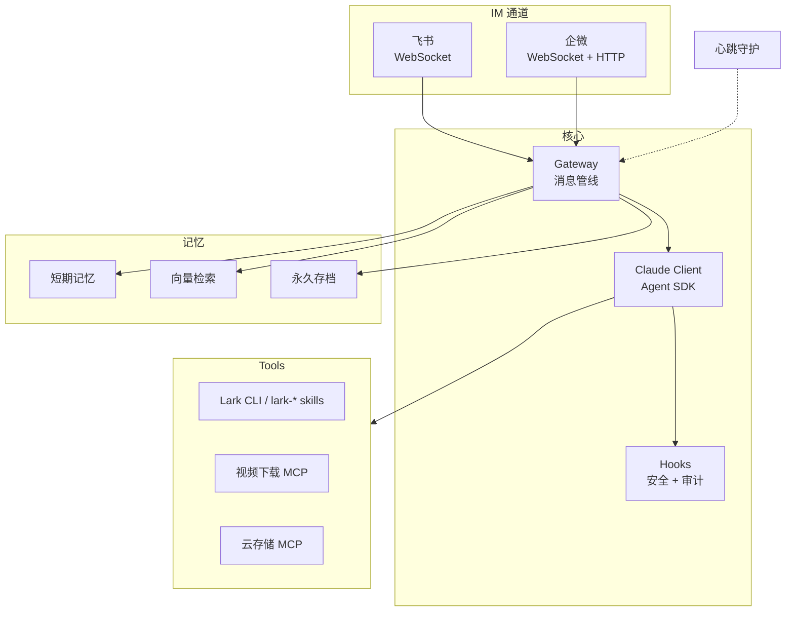

<div align="center">

# OpenMist

[](https://github.com/mistprismlabs/open-mist/actions/workflows/ci.yml)
[](LICENSE)


**破雾寻光** — 穿越迷雾，直抵本质

把 Claude Code 当作 Agent 运行时，直接获得它的工具生态、安全模型和持续进化。
不重造轮子，只做 Claude Code 做不到的事。

[English](README.en.md)

</div>

---

## 10 分钟部署

> 你只需要一台 Ubuntu 服务器 + 任意 AI 编程工具（Claude Code / Cursor / Windsurf）

把下面这段提示词发给你的 AI，它会通过 SSH 帮你完成首次部署：

```
SSH 连接我的服务器 <IP>，部署 OpenMist（https://github.com/mistprismlabs/open-mist）。

步骤：
1. 先读取 docs/deploy.md 和 .claude/skills/openmist-bootstrap.md
2. 严格按执行协议分阶段推进，不要跳步骤
3. 登录后先运行 scripts/check-runtime.sh
4. 优先调用仓库里的 bootstrap/check 脚本，不要现场重写整套流程
5. 引导我配置 .env — 只在必要时逐个问我要密钥或授权
6. 配置 systemd 开机自启
7. 部署完成后执行 scripts/check-config.sh、scripts/check-service.sh 和 npm test
```

AI 会自动搭建环境、安装依赖、配置服务，遇到需要密钥的地方停下来问你。

标准部署文档见 [docs/deploy.md](docs/deploy.md)。
如果你的 AI 支持仓库内技能，也可以让它先读取 [.claude/skills/openmist-bootstrap.md](.claude/skills/openmist-bootstrap.md)。

### 你需要准备什么

- 一台可以通过 SSH 登录的 Ubuntu 服务器
- 一个可登录账号；最好具备 `sudo`
- 至少一组 `ANTHROPIC_API_KEY` 或 `ANTHROPIC_AUTH_TOKEN`
- 如果要启用飞书 / 企微 / 微信通道，再准备对应平台凭据

### AI 会自己做什么

- 检查 SSH 后的服务器初始状态
- 创建普通部署用户
- 安装系统依赖、Node.js、`claude`、`lark-cli`
- `git clone`、`npm install`
- 生成 `.env`
- 调用 `bootstrap/check` 脚本完成检查、配置和 `systemd` 启动
- 运行 `scripts/check-runtime.sh`、`scripts/check-config.sh`、`scripts/check-service.sh`、`npm test`

### 必须由你参与的步骤

- 提供 API key、app secret、token、chat_id、open_id 等实例密钥
- 完成 `claude` 登录授权
- 完成 `lark-cli` 的扫码或网页登录授权
- 确认飞书 / 企微开放平台侧设置是否已开通
- 决定私有域名、私有路径、私有服务名等实例差异

这意味着现在的默认部署成本已经很低：AI 负责流程和执行，你主要负责密钥、授权和平台侧确认。

<details>
<summary><b>手动部署</b></summary>

```bash
npm install -g @anthropic-ai/claude-code
git clone https://github.com/mistprismlabs/open-mist.git
cd open-mist && npm install
cp .env.example .env  # 编辑填入 API Key
npm start
```

</details>

### 环境变量

默认至少需要一组 Anthropic 兼容凭据。没有凭证的通道不会启动。

| 变量 | 说明 |
|------|------|
| `ANTHROPIC_API_KEY` / `ANTHROPIC_AUTH_TOKEN` | **至少其一必填** — Anthropic 或 Anthropic 兼容提供商的访问凭据 |
| `ANTHROPIC_BASE_URL` | 可选 — Anthropic 兼容提供商入口，例如 MiniMax 可配置为 `https://api.minimaxi.com/anthropic` |
| `CLAUDE_MODEL` / `RECOMMEND_MODEL` | 使用 Anthropic 兼容提供商时建议显式填写，不要依赖 Anthropic 默认模型名 |
| `FEISHU_APP_ID` / `APP_SECRET` | 飞书通道 |
| `WECOM_BOT_ID` / `WECOM_BOT_SECRET` | 企微 Bot（WebSocket 长连接） |
| `WECOM_CORP_ID` / `AGENT_SECRET` | 企微 App（HTTP 回调） |
| `WEIXIN_ENABLED` / `WEIXIN_TOKEN` | 微信龙虾通道（可手填 token，或使用 `npm run weixin:login` 原生扫码落盘） |
| `DASHSCOPE_API_KEY` | 向量记忆（不配则降级为关键词） |
| `COS_SECRET_ID` / `SECRET_KEY` | 腾讯云对象存储 |

完整列表见 [.env.example](.env.example)

如果你使用 MiniMax 这类 Anthropic 兼容提供商，常见配置是：

```bash
ANTHROPIC_BASE_URL=https://api.minimaxi.com/anthropic
CLAUDE_MODEL=MiniMax-M2.7
RECOMMEND_MODEL=MiniMax-M2.7-highspeed
```

---

## 它能做什么

```
用户 (飞书/企微)          OpenMist                    Claude
      │                     │                           │
      ├── 发消息 ──────────▶│                           │
      │                     ├── 检索相关记忆             │
      │                     ├── 注入上下文 ─────────────▶│
      │                     │                           ├── 思考 + 调用工具
      │                     │◀── 流式返回结果 ───────────┤
      │◀── 卡片/Markdown ──┤                           │
      │                     ├── 保存对话记忆             │
      │                     ├── 提取实体和决策           │
```

**通道** — 飞书 WebSocket + 企微双通道（Bot WebSocket / App HTTP），按需启用

**记忆** — 三层架构：工作记忆（关键词） → 向量检索（语义） → 永久存档，70/30 混合搜索，自动降级

**安全** — SDK Hooks 层面拦截，不是提示词层面。Bash 危险命令、路径越权、Skill 安装全部硬拦截

**自愈** — 心跳守护每 30 分钟巡检，自动修复权限漂移、cron 失败、磁盘压力

**工具** — Claude 侧飞书平台操作统一使用官方 Lark CLI / `lark-*` skills；项目内仅保留少量 MCP（如视频下载、云存储）。

---

## 架构



---

## 项目结构

```
src/
├── index.js                 # 入口
├── gateway.js               # 消息管线：记忆检索 → Claude → 追踪
├── claude.js                # Agent SDK 封装 + Lark CLI / MCP 工具接线
├── hooks.js                 # 安全守卫 + 审计日志 + Skill 白名单
├── session.js               # 多租户会话（过期、轮转、历史）
├── user-profile.js          # 用户偏好初始化
├── channels/
│   ├── feishu.js            # 飞书（WebSocket 长连接）
│   └── wecom.js             # 企微（Bot WS + App HTTP）
├── memory/
│   ├── memory-manager.js    # 三层记忆编排
│   ├── short-term.js        # 关键词搜索
│   ├── vector-store.js      # DashScope + sqlite-vec
│   └── metrics.js           # 管线指标
├── heartbeat.js             # 自愈守护
├── deployer.js              # nginx 子域名自动部署
├── mcp-video.mjs            # MCP: 视频
└── mcp-cos.mjs              # MCP: 云存储
```

---

## 工具模型

- 消息接入保留在项目 runtime 适配器中，如 `src/channels/feishu.js`、`src/channels/wecom.js`。
- Claude 侧的 Lark/飞书平台操作统一使用官方 Lark CLI / `lark-*` skills。
- 项目内的 MCP 仅保留轻量、非 Lark 平台能力的集成，如视频下载和云存储。

---

## 开源边界

`open-mist` 是通用能力主仓，不承载任何私有实例默认值。

以下内容必须通过 `.env`、部署脚本或下游私有仓提供，不应在源码里写死：

- 运行用户名 / 用户组、systemd 服务名、辅助服务名、健康检查地址
- SSH 远端别名、私有域名、私有路径、存储桶、私有主机约定
- 私有人设、角色预设、通知目标、企业内部运维流程
- API keys、tokens、open_id、chat_id、bucket id 等实例级标识

推荐分层：

- `open-mist`：通用能力、开源可发布代码
- 私有实例仓：部署覆盖、私有 persona、私有服务接线、私有运维脚本

如果某项改动无法直接公开，应先参数化或下沉到私有仓，而不是把私有默认值带进 `open-mist`。

---

## 为什么不用 OpenClaw

OpenClaw 在 Claude 外面再套一层 Agent 循环。OpenMist 直接用 Claude Code 作为运行时 — 上游每次更新（新工具、更好的规划、更快的执行）自动流入，零适配成本。

| | OpenClaw | OpenMist |
|--|----------|----------|
| 运行时 | 自建 Agent 循环 | Claude Code 原生 SDK |
| 安全 | 应用层 | SDK Hooks — 运行时拦截 |
| 记忆 | 自行实现 | 三层混合 + 多租户隔离 |
| 工具 | 自定义定义 | MCP 协议，复用生态 |
| 自愈 | 手动 | AI 心跳守护 |
| 部署 | 容器化 | 单进程 + systemd |

---

## 贡献

1. Fork → 特性分支 → PR
2. 每个 PR 只做一件事
3. `npm test` 通过再提交

## 许可证

[MIT](LICENSE)
