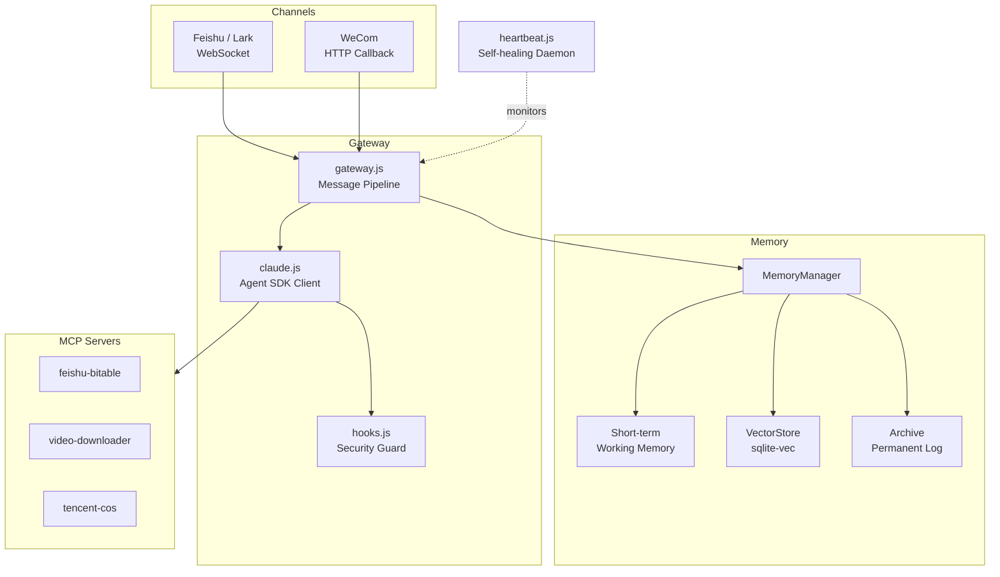

# OpenMist

[](LICENSE)

**Cut through the fog, find the light.**

OpenMist is a production-grade intelligent assistant gateway built on the Claude Agent SDK. It connects Claude to IM platforms (Feishu/Lark, WeCom) with enterprise features: multi-layer memory, SDK security hooks, and AI-powered self-healing.

---

## Key Features

### Production Claude Agent SDK Security Hooks

First open-source reference implementation of SDK security hooks. Bash command filtering blocks destructive operations, credential leaks, and privilege escalation. Write/Edit path whitelisting prevents unauthorized file access. Every tool invocation is logged to an append-only audit trail.

### Hybrid Memory for LLM Assistants

Three-layer memory system -- working memory, vector retrieval, and permanent archive. Hybrid search blends 70% semantic similarity (DashScope embeddings + sqlite-vec) with 30% keyword matching. Conversations are automatically summarized and indexed on session end.

### Multi-Channel LLM Gateway

Unified gateway pattern decouples message processing from platform specifics. Feishu (WebSocket) and WeCom adapters are included; adding a new channel means implementing a single adapter class. Session management, media handling, and memory injection happen at the gateway level.

### AI-Powered Self-Healing

Heartbeat daemon runs every 30 minutes with two-phase checks: native checks (orphan process cleanup, file permission audit, VectorStore writability) execute instantly, then Claude analyzes system state and auto-remediates issues like failed cron jobs or disk pressure.

---

## Architecture



---

## Quick Start

### Prerequisites

- Node.js >= 18
- [Claude Code CLI](https://github.com/anthropics/claude-code) — the Agent SDK calls Claude CLI internally
- SQLite3 (for sqlite-vec)
- An Anthropic API key (or compatible endpoint)
- Feishu app credentials (App ID + App Secret)

### Install

```bash
# 1. Install Claude Code CLI (required — the Agent SDK depends on it)
npm install -g @anthropic-ai/claude-code

# 2. Clone and install
git clone https://github.com/chituhouse/open-mist.git
cd open-mist
npm install
```

### Configure

Copy the example and fill in your credentials:

```bash
cp .env.example .env
```

Key variables in `.env`:

| Variable | Description |
|----------|-------------|
| `ANTHROPIC_API_KEY` | Anthropic API key |
| `ANTHROPIC_BASE_URL` | API endpoint (default: `https://api.anthropic.com`) |
| `CLAUDE_MODEL` | Model ID (default: `claude-opus-4-6`) |
| `FEISHU_APP_ID` | Feishu app ID |
| `FEISHU_APP_SECRET` | Feishu app secret |
| `DASHSCOPE_API_KEY` | Alibaba DashScope key (for embeddings) |
| `WECOM_CORP_ID` | WeCom corp ID (optional, enables WeCom channel) |
| `COS_SECRET_ID` | Tencent Cloud COS secret ID (optional) |
| `COS_SECRET_KEY` | Tencent Cloud COS secret key (optional) |

### Run

```bash
npm start
```

For production, use systemd or a process manager:

```bash
# systemd example
sudo systemctl enable --now feishu-bot.service
```

---

## Project Structure

```
src/
  index.js              # Entry point
  gateway.js            # Message pipeline (memory retrieval -> Claude -> tracking)
  claude.js             # Claude Agent SDK wrapper + MCP server config
  hooks.js              # PreToolUse security guard + PostToolUse audit logger
  session.js            # Session store with expiry and rotation
  channels/
    base.js             # Channel adapter interface
    feishu.js           # Feishu/Lark WebSocket adapter
    wecom.js            # WeCom adapter
  memory/
    memory-manager.js   # Three-layer memory orchestrator
    short-term.js       # Working memory (in-process, keyword search)
    vector-store.js     # Semantic search (DashScope + sqlite-vec)
    metrics.js          # Memory pipeline metrics
  heartbeat.js          # Self-healing daemon
  deployer.js           # Auto subdomain deployment (nginx)
  mcp-bitable.mjs       # MCP: Feishu Bitable read/write
  mcp-video.mjs         # MCP: Video downloader
  mcp-cos.mjs           # MCP: Tencent Cloud COS
agents/                 # Recommendation engine
scripts/                # Ops scripts (cron jobs, cleanup, reports)
docs/                   # API references and dev notes
```

---

## MCP Servers

OpenMist includes three MCP (Model Context Protocol) servers that extend Claude's capabilities:

| Server | File | Description |
|--------|------|-------------|
| feishu-bitable | `src/mcp-bitable.mjs` | Read/write Feishu Bitable (spreadsheet) records |
| video-downloader | `src/mcp-video.mjs` | Download videos from YouTube, Bilibili, etc. |
| tencent-cos | `src/mcp-cos.mjs` | Upload/download files, generate presigned URLs |

MCP servers are spawned automatically by the Claude client. No separate setup required.

---

## Contributing

Contributions are welcome. Please:

1. Fork the repo and create a feature branch
2. Keep changes focused -- one feature or fix per PR
3. Test your changes before submitting
4. Write clear commit messages

---

## License

[MIT](LICENSE)
