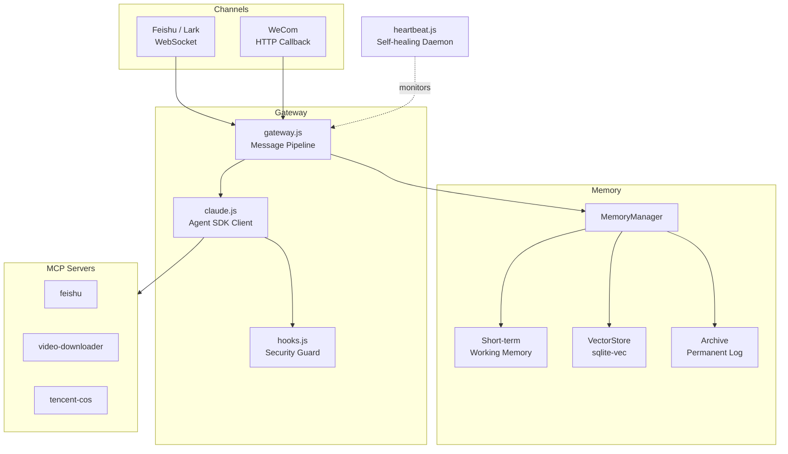

# OpenMist

[](LICENSE)


**Cut through the fog, find the light.** / **破雾寻光**

> An enterprise-grade Claude Agent runtime — built on Claude Agent SDK + Claude Code, delivering what OpenClaw promises but with production-proven security, memory, and self-healing.

---

## Why OpenMist

OpenClaw provides a framework for building AI agents. OpenMist takes a different approach: instead of wrapping Claude behind another abstraction layer, it runs Claude Code directly as the agent runtime, gaining its full tool ecosystem, security model, and extensibility for free.

| Capability | OpenClaw | OpenMist |
|------------|----------|----------|
| **Runtime** | Custom agent loop | Claude Code (native SDK) |
| **Security** | Application-level guards | SDK Hooks — PreToolUse interception at the runtime layer, not bypassable by prompts |
| **Memory** | Stateless / BYO | Three-layer hybrid: working memory + vector search + permanent archive |
| **Tool Ecosystem** | Custom tool definitions | MCP protocol — reuse any MCP server, no adapter code |
| **Self-healing** | Manual ops | AI-powered heartbeat: auto-remediate cron failures, disk pressure, permission drift |
| **IM Integration** | API-only | Native Feishu/WeCom adapters with streaming cards, media handling, session management |
| **Deployment** | Container-based | Single Node.js process + systemd, auto subdomain provisioning |

The core insight: Claude Code is already the most capable agent runtime. Building on top of it — rather than rebuilding it — means every upstream improvement (new tools, better planning, faster execution) flows through automatically.

---

## Key Features

### SDK-Level Security Hooks

Production-hardened security that operates at the Claude Code runtime layer, not the application layer. Bash command filtering blocks 5 categories of destructive operations (irreversible destruction, credential leaks, raw env dumps, sudo escalation, eval injection) while allowing all legitimate system operations. Write/Edit path whitelisting prevents unauthorized file access. Every tool invocation is logged to an append-only audit trail.

### Three-Layer Hybrid Memory + MMR Retrieval

Working memory (in-process, keyword search) for current session context. Vector retrieval (DashScope embeddings + sqlite-vec) for semantic recall across sessions. Permanent archive for conversation summarization and long-term knowledge. Hybrid search blends 70% semantic similarity with 30% keyword matching, with automatic fallback to keyword-only when the vector layer is unavailable. **v1.2**: MMR (Maximal Marginal Relevance) reranking eliminates redundant memories; time decay with 30-day half-life ensures recent memories surface first, while high-importance memories are exempt from decay.

### Multi-Channel Gateway + User Onboarding

Unified message pipeline decouples Claude interaction from platform specifics. Feishu (WebSocket long connection) and WeCom (HTTP callback + enterprise app) adapters are included. Adding a new channel means implementing a single adapter class. Session management, media handling, streaming card updates, and memory injection happen at the gateway level. **v1.2**: First-time users are greeted with an onboarding card to set assistant name, preferred form of address, usage scenario, and language — preferences are persisted and injected into every conversation.

### AI-Powered Self-Healing + Auto-Update

Heartbeat daemon runs two-phase checks every 30 minutes. Phase 1 (native): orphan process cleanup, file permission audit, VectorStore writability test — executes in milliseconds. Phase 2 (AI): Claude analyzes system state and auto-remediates issues like failed cron jobs, disk pressure, or stale locks. Notifications aggregate into a daily digest instead of spamming alerts. **v1.2**: Automatic update mechanism checks 3 sources daily (Claude CLI, Agent SDK, repository) — notifies via Feishu card, user approves, independent cron script executes safely, bot restarts and confirms.

### MCP Tool Servers

Three built-in MCP servers extend Claude's capabilities without custom tool code:

| Server | Description |
|--------|-------------|
| `feishu` | Full Feishu API: Bitable CRUD, document creation with auto-grant, drive operations, messaging |
| `video-downloader` | Download videos from YouTube, Bilibili, Douyin, etc. |
| `tencent-cos` | Tencent Cloud COS: upload, download, presigned URLs |

MCP servers are spawned automatically by the Claude client. No separate setup required.

---

## Architecture



---

## Quick Start

### Prerequisites

- Node.js >= 18
- [Claude Code CLI](https://github.com/anthropics/claude-code) — the Agent SDK runs on Claude Code
- SQLite3 (for sqlite-vec)
- An Anthropic API key (or compatible endpoint)
- Feishu app credentials (App ID + App Secret)

### Install

```bash
# 1. Install Claude Code CLI (required)
npm install -g @anthropic-ai/claude-code

# 2. Clone and install
git clone https://github.com/chituhouse/open-mist.git
cd open-mist
npm install
```

### Configure

```bash
cp .env.example .env
```

Key variables:

| Variable | Description |
|----------|-------------|
| `ANTHROPIC_API_KEY` | Anthropic API key |
| `ANTHROPIC_BASE_URL` | API endpoint (default: `https://api.anthropic.com`) |
| `CLAUDE_MODEL` | Model ID (default: `claude-opus-4-6`) |
| `FEISHU_APP_ID` | Feishu app ID |
| `FEISHU_APP_SECRET` | Feishu app secret |
| `DASHSCOPE_API_KEY` | Alibaba DashScope key (for embeddings) |
| `WECOM_CORP_ID` | WeCom corp ID (optional) |
| `COS_SECRET_ID` | Tencent Cloud COS secret ID (optional) |
| `COS_SECRET_KEY` | Tencent Cloud COS secret key (optional) |

### Run

```bash
npm start
```

Production deployment:

```bash
sudo systemctl enable --now feishu-bot.service
```

---

## Project Structure

```
src/
  index.js              # Entry point
  gateway.js            # Message pipeline (memory -> Claude -> tracking)
  claude.js             # Claude Agent SDK wrapper + MCP config
  hooks.js              # PreToolUse security guard + PostToolUse audit
  session.js            # Session store with expiry and rotation
  user-profile.js       # User preferences (onboarding + personalization)
  channels/
    base.js             # Channel adapter interface
    feishu.js           # Feishu/Lark WebSocket adapter
    wecom.js            # WeCom adapter
  memory/
    memory-manager.js   # Three-layer memory orchestrator
    short-term.js       # Working memory (keyword search)
    vector-store.js     # Semantic search (DashScope + sqlite-vec)
    metrics.js          # Memory pipeline metrics
  heartbeat.js          # Self-healing daemon
  deployer.js           # Auto subdomain deployment (nginx)
  mcp-feishu.mjs        # MCP: Feishu API (Bitable, Docs, Drive, Messaging)
  mcp-video.mjs         # MCP: Video downloader
  mcp-cos.mjs           # MCP: Tencent Cloud COS
scripts/                # Ops automation (cron jobs, cleanup, reports)
  check-updates.js      # Daily update checker (CLI, SDK, repo)
  apply-update.js       # Approved update executor
.claude/skills/         # Dev workflow skills (dev-go, dev-fix, dev-refactor)
```

---

## Contributing

Contributions welcome:

1. Fork and create a feature branch
2. One feature or fix per PR
3. Test before submitting
4. Clear commit messages

---

## License

[MIT](LICENSE)
