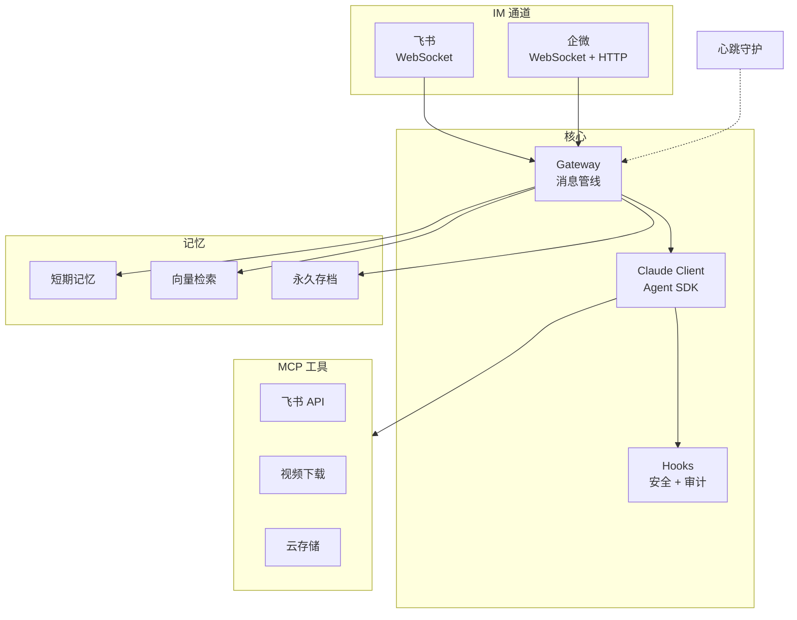

<div align="center">

# OpenMist

[](https://github.com/mistprismlabs/open-mist/actions/workflows/ci.yml)
[](LICENSE)


**破雾寻光** — 穿越迷雾，直抵本质

把 Claude Code 当作 Agent 运行时，直接获得它的工具生态、安全模型和持续进化。
不重造轮子，只做 Claude Code 做不到的事。

[English](README.en.md)

</div>

---

## 10 分钟部署

> 你只需要一台 Ubuntu 服务器 + 任意 AI 编程工具（Claude Code / Cursor / Windsurf）

把下面这段提示词发给你的 AI，它会通过 SSH 帮你完成一切：

```
SSH 连接我的服务器 <IP>，部署 OpenMist（https://github.com/mistprismlabs/open-mist）。

步骤：
1. 安装 Node.js 和 Claude Code CLI
2. 克隆仓库，npm install
3. 引导我配置 .env — 逐个问我要 API Key，没有的跳过
4. 配置 systemd 开机自启
5. 部署完成后验证服务正常
```

AI 会自动搭建环境、安装依赖、配置服务，遇到需要密钥的地方停下来问你。

<details>
<summary><b>手动部署</b></summary>

```bash
npm install -g @anthropic-ai/claude-code
git clone https://github.com/mistprismlabs/open-mist.git
cd open-mist && npm install
cp .env.example .env  # 编辑填入 API Key
npm start
```

</details>

### 环境变量

只有 `ANTHROPIC_API_KEY` 是必填的，其余按需配置。没有凭证的通道不会启动。

| 变量 | 说明 |
|------|------|
| `ANTHROPIC_API_KEY` | **必填** — Claude API 密钥 |
| `FEISHU_APP_ID` / `APP_SECRET` | 飞书通道 |
| `WECOM_BOT_ID` / `BOT_SECRET` | 企微 Bot（WebSocket 长连接） |
| `WECOM_CORP_ID` / `AGENT_SECRET` | 企微 App（HTTP 回调） |
| `DASHSCOPE_API_KEY` | 向量记忆（不配则降级为关键词） |
| `COS_SECRET_ID` / `SECRET_KEY` | 腾讯云对象存储 |

完整列表见 [.env.example](.env.example)

---

## 它能做什么

```
用户 (飞书/企微)          OpenMist                    Claude
      │                     │                           │
      ├── 发消息 ──────────▶│                           │
      │                     ├── 检索相关记忆             │
      │                     ├── 注入上下文 ─────────────▶│
      │                     │                           ├── 思考 + 调用工具
      │                     │◀── 流式返回结果 ───────────┤
      │◀── 卡片/Markdown ──┤                           │
      │                     ├── 保存对话记忆             │
      │                     ├── 提取实体和决策           │
```

**通道** — 飞书 WebSocket + 企微双通道（Bot WebSocket / App HTTP），按需启用

**记忆** — 三层架构：工作记忆（关键词） → 向量检索（语义） → 永久存档，70/30 混合搜索，自动降级

**安全** — SDK Hooks 层面拦截，不是提示词层面。Bash 危险命令、路径越权、Skill 安装全部硬拦截

**自愈** — 心跳守护每 30 分钟巡检，自动修复权限漂移、cron 失败、磁盘压力

**工具** — 通过 MCP 协议扩展，内置飞书 API、视频下载、云存储三个 MCP Server

---

## 架构



---

## 项目结构

```
src/
├── index.js                 # 入口
├── gateway.js               # 消息管线：记忆检索 → Claude → 追踪
├── claude.js                # Agent SDK 封装 + MCP 配置
├── hooks.js                 # 安全守卫 + 审计日志 + Skill 白名单
├── session.js               # 多租户会话（过期、轮转、历史）
├── user-profile.js          # 用户偏好初始化
├── channels/
│   ├── feishu.js            # 飞书（WebSocket 长连接）
│   └── wecom.js             # 企微（Bot WS + App HTTP）
├── memory/
│   ├── memory-manager.js    # 三层记忆编排
│   ├── short-term.js        # 关键词搜索
│   ├── vector-store.js      # DashScope + sqlite-vec
│   └── metrics.js           # 管线指标
├── heartbeat.js             # 自愈守护
├── deployer.js              # nginx 子域名自动部署
├── mcp-feishu.mjs           # MCP: 飞书
├── mcp-video.mjs            # MCP: 视频
└── mcp-cos.mjs              # MCP: 云存储
```

---

## 为什么不用 OpenClaw

OpenClaw 在 Claude 外面再套一层 Agent 循环。OpenMist 直接用 Claude Code 作为运行时 — 上游每次更新（新工具、更好的规划、更快的执行）自动流入，零适配成本。

| | OpenClaw | OpenMist |
|--|----------|----------|
| 运行时 | 自建 Agent 循环 | Claude Code 原生 SDK |
| 安全 | 应用层 | SDK Hooks — 运行时拦截 |
| 记忆 | 自行实现 | 三层混合 + 多租户隔离 |
| 工具 | 自定义定义 | MCP 协议，复用生态 |
| 自愈 | 手动 | AI 心跳守护 |
| 部署 | 容器化 | 单进程 + systemd |

---

## 贡献

1. Fork → 特性分支 → PR
2. 每个 PR 只做一件事
3. `npm test` 通过再提交

## 许可证

[MIT](LICENSE)
